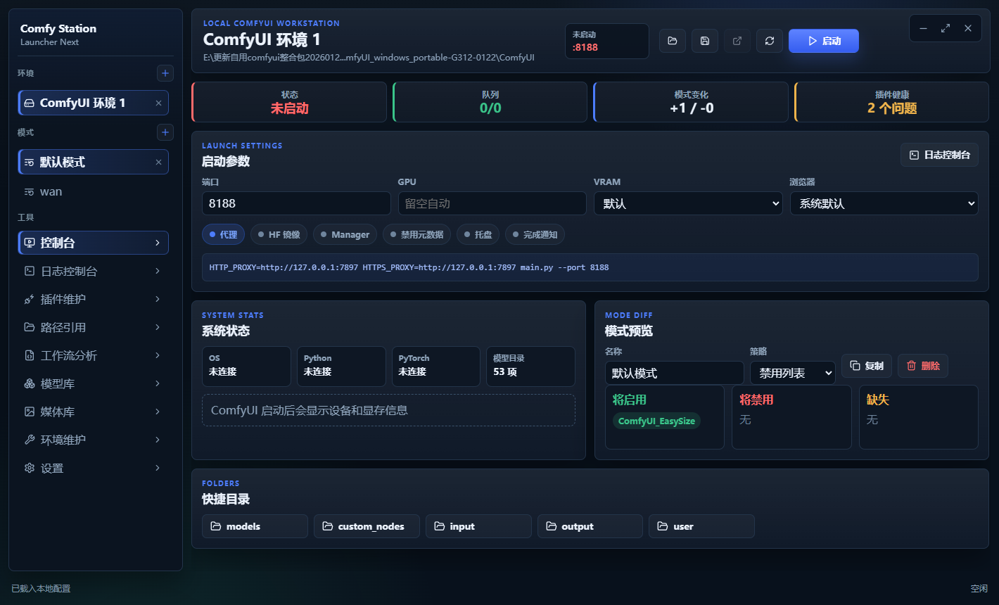

# ComfyUI Launcher Next

<p align="center">
  <a href="./README.md"><b>中文</b></a>
  ·
  <a href="./README.en.md"><b>English</b></a>
</p>

<p align="center">
  <a href="#download">Download</a>
  ·
  <a href="#quick-start">Quick Start</a>
  ·
  <a href="#features">Features</a>
  ·
  <a href="#screenshots">Screenshots</a>
  ·
  <a href="#safety">Safety</a>
  ·
  <a href="#development">Development</a>
  ·
  <a href="#roadmap">Roadmap</a>
</p>

ComfyUI Launcher Next is a Windows desktop launcher and local workstation for your own ComfyUI installation.

It does not bundle ComfyUI, does not require an online account, and does not automatically import configuration from other launchers. On first run, you manually select the ComfyUI folder that contains `main.py` and the Python executable used by that environment.



## Why This Exists

Running ComfyUI locally usually means juggling a terminal window, a browser tab, plugin folders, Git commands, Python packages, model directories, and output files. This project puts those daily tasks behind a compact desktop UI:

- Start and stop ComfyUI without keeping a command prompt visible.
- Read runtime logs in the app.
- Maintain custom nodes safely with backup and restore actions.
- Switch plugin sets for different workflows.
- Browse output images and videos without leaving the launcher.
- Keep common environment checks close to the launch controls.

## Download

Download the latest build from [Releases](https://github.com/lhhkuki/comfyui-launcher-next/releases).

Available assets:

```text
ComfyUI.Launcher.Next.Setup.0.1.0.exe
ComfyUI.Launcher.Next.0.1.0.Portable.zip
```

Choose the installer if you want Start Menu and desktop shortcuts. Choose the portable ZIP if you prefer to unzip and run the app directly.

The installer is currently unsigned, so Windows SmartScreen may show a warning. Verify the file source before running it.

## Quick Start

1. Open **Settings**.
2. Set **ComfyUI Path** to the folder containing `main.py`.
3. Set **Python Path** to the Python executable for that ComfyUI environment.
4. Save the configuration.
5. Open **Console** and click **Start**.

Typical portable ComfyUI paths:

```text
D:\ComfyUI_windows_portable\ComfyUI
D:\ComfyUI_windows_portable\python_embeded\python.exe
```

## Features

### Environment Management

- Create and manage multiple local ComfyUI environments.
- Store ComfyUI path, Python path, port, GPU, browser, proxy, Hugging Face mirror, VRAM mode, and extra launch arguments per environment.
- Use the system browser, a detected browser, or a custom browser path.
- Keep configuration local under Electron's user data folder.

### Launch Console

- Start, stop, and restart ComfyUI.
- Preview the generated command line before launch.
- Configure common launch options without editing scripts.
- Detect service URL and open the ComfyUI web UI from the launcher.
- Hide backend command windows in packaged builds.

### Runtime Logs

- Stream stdout and stderr from ComfyUI in real time.
- Auto-scroll to the latest line.
- Filter errors and warnings.
- Copy or clear logs.
- Extract common diagnostics such as missing Python packages, missing nodes, occupied ports, and CUDA memory errors.
- Interrupt generation, clear the queue, and request memory release from the ComfyUI API.

### Mode Management

- Create, copy, rename, and delete modes.
- Maintain enabled and disabled custom node lists per mode.
- Use either a disabled-list strategy or an enabled-only strategy.
- Preview which plugins will be enabled, disabled, or missing before applying a mode.

### Custom Node Maintenance

- Scan `custom_nodes` and `custom_nodes\.disabled`.
- Show enabled state, Git branch, commit, remote, requirements status, and health hints.
- Detect duplicate plugins, missing Git remotes, and detached HEAD states.
- Open plugin folders.
- Enable or disable plugins by moving folders between `custom_nodes` and `.disabled`.
- Install plugins from GitHub URLs.
- Back up plugins before risky operations.
- Restore from backups.
- Update Git plugins.
- Repair common Git state.
- Bind a Git remote to a local plugin.
- Install `requirements.txt` with the selected environment's Python executable.

### Path References

- Manage additional model, plugin, workflow, input, output, and user folders.
- Open referenced paths from the UI.
- Generate an extra model path configuration that ComfyUI can read.
- Quickly open common folders such as `models`, `custom_nodes`, `input`, `output`, and `user`.

### Workflow Analysis

- Select a workflow JSON file.
- Parse node types from the workflow.
- Compare nodes against locally installed plugins.
- Show matched plugins, missing nodes, and suggested handling items.
- Create a temporary mode from locally matched plugins.

### Model Browser

- Scan local model folders and additional model references.
- Search model files.
- Group models by folder category.
- Support common model extensions such as `safetensors`, `ckpt`, `pt`, `pth`, `gguf`, and `onnx`.
- Reveal files in Windows Explorer.

### Media Browser

- Browse images and videos in the ComfyUI output folder.
- Preview images with centered containment.
- Preview videos with playback controls.
- Reveal or delete output files.
- Read recent ComfyUI `/history` when the server is running.

### Environment Tools

- Check Python, PyTorch, TorchVision, TorchAudio, xformers, Triton, SageAttention, and Nunchaku package status.
- Run `pip list`.
- Install plugin requirements.
- Run common dependency installation commands.
- Inspect and update the ComfyUI Git core.

## Screenshots


## Project Layout

```text
electron/          Electron main process, preload bridge, shared types
src/               React renderer and styles
build/             NSIS installer script
scripts/           Windows packaging script
release/           Generated release artifacts, ignored by Git
```

## Data Location

The app stores its local state in Electron's `userData` directory:

```text
%APPDATA%\comfyui-launcher-next
```

Important files and folders:

- `launcher-next.config.json`: launcher configuration.
- `logs\`: runtime logs.
- `backups\`: plugin backups.

## Safety

- The launcher does not modify ComfyUI automatically.
- Write operations happen only after explicit user actions such as save, start, install, update, disable, delete, or restore.
- Plugin disable and enable actions move directories between `custom_nodes` and `custom_nodes\.disabled`.
- Dependency installation uses the Python executable configured for the selected environment.
- The app does not automatically choose every Torch/CUDA variant. Check package commands before running them.
- Keep your own backups for important production environments.

## Development

Install dependencies:

```powershell
npm install
```

Run in development mode:

```powershell
npm run dev
```

Type-check and build:

```powershell
npm run typecheck
npm run build
```

Create Windows release artifacts:

```powershell
npm run dist:win
```

This creates a portable ZIP. If `makensis.exe` is available, it also creates a Windows setup EXE.

## Roadmap

- Better workflow node to plugin matching from public sources.
- Richer model and LoRA metadata browsing.
- More startup diagnostics and fix suggestions.
- Portable configuration migration tools.
- Signed Windows builds.
- More languages and themes.

## License

MIT
